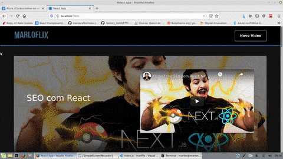

<div align="center">
  <a href="https://www.alura.com.br/">
    
  </a>
</div>

# Marloflix
## Aluraflix

Projeto que agrega conceitos aprendidos durante a imersão react Alura incluindo:

- React
- Hooks
- Styled-components
- Componentização e estrutura de pastas
- Deploy Heroku & Vercel

# Como instalar

Clone ou baixe o repositório, acesse a pasta do projeto via terminal e 
execute o comando:

```Ỳarn install``` 
ou
```npm install``` 

# 


